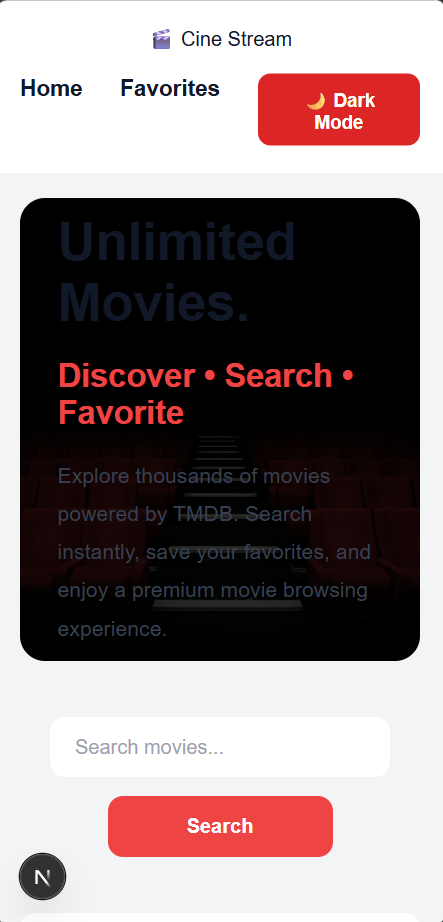

# 🎬 Cine Stream

Cine Stream is a modern movie discovery web application built with **Next.js 15** and powered by the **TMDB API**. Users can browse popular movies, search for titles, view detailed movie information, manage favorites, apply global filters, and switch between dark and light themes using Redux Toolkit.

## 🚀 Features

### 🎥 Movie Discovery
- Browse popular movies from TMDB
- Search movies by title
- View detailed movie information
- Responsive movie cards

### ❤️ Favorites
- Add movies to favorites
- Remove movies from favorites
- Favorites managed using Redux Toolkit
- Local storage persistence

### 🔍 Global Filters
- Filter movies by minimum rating
- Filter movies by genre
- Instant UI updates using Redux global state

### 🌙 Theme Manager
- Dark Mode
- Light Mode
- Global theme controlled using Redux Toolkit

### ⚡ Performance Optimizations
- Server-side rendering with Next.js App Router
- Optimized filtering using `useMemo`
- Optimized event handlers using `useCallback`
- Next.js Image optimization
- SEO metadata generation

# 🛠️ Tech Stack

- Next.js 15
- React 19
- Redux Toolkit
- React Redux
- TMDB API
- CSS3
- JavaScript (ES6+)

## Live Demo
https://cine-stream-next-self.vercel.app/

## Screenshots
### Desktop View

### Mobile View

### Lighthouse Report

### LightMode 
